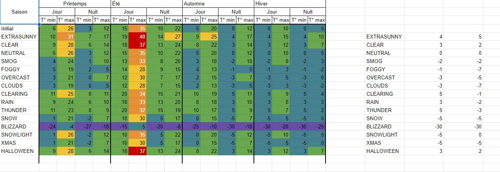

# How does the temperature system work?

In the [temperature](../../resources/[soz]/soz-core/src/server/weather/temperature.ts) file, you will see temperature
ranges variable depending on the season.

These are the minimal and maximal values that will be used to generate a random value, but sometimes you want to have
wider or narrower ranges depending on the weather.

For each `Weather` you have adder/subtractor values that will be applied to the temperature range.

In the end, it's recommended to have a little sheet with the computed values to have a better idea of what values you
will get.

Below is the retranscription of the computed ranges for each weather and season.

