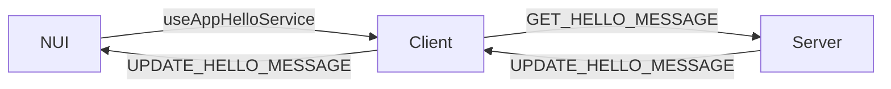

# How to create an APP for soz-phone?

This short guide will help you understand how events are passed between NUI, the client and the server.
You might apply these concepts on the soz-core project when using NUI as well, but the naming convention is slightly
different.

For the purpose of this guide, we will assume you want to build a simple app that will display a hello world from the
server to the phone.

**VERY IMPORTANT NOTE**: The paths commented in the code are relative to the `soz-phone` folder. Please keep that in
mind when you will create your own app.

## Architecture schema

A very simplified schema of how the events are going to communicate to each other.



## Prepare the types for the app

Create a file `hello.ts` in the `typings` folder to generate the types and events that will be used.

```ts
// src/typings/hello.ts
export enum HelloEvents {
    GET_HELLO_MESSAGE = 'phone:app:hello:getHelloMessage',
    UPDATE_HELLO_MESSAGE = 'phone:app:hello:updateHelloMessage',
}
```

Then add your app in the app enum in `src/utils/apps.ts`.

```ts
// src/utils/apps.ts
export default {
    // ...
    HELLO: 'HELLO',
}
```

Before sending messages to the client, you need to prepare a small function that will do the boilerplate for you.

```ts
// src/utils/messages.ts

export function sendHelloEvent(method: string, data: any = {}): void {
    sendMessage(apps.HELLO, method, data);
}
```

## Client

Next you will create a client file in the `src/client/apps` folder, let's call it `hello.ts`.

Inside you will put the events that will be triggered by the server or the phone.

```ts
// src/client/apps/hello.ts
import { HelloEvents } from '../../../typings/app/hello';
import { sendHelloEvent } from '../../utils/messages';
import { RegisterNuiProxy } from '../cl_utils';

// When we use this event, this will be retrieved by the server directly.
RegisterNuiProxy(HelloEvents.GET_HELLO_MESSAGE);

onNet(HelloEvents.UPDATE_HELLO_MESSAGE, (result: string) => {
    // The NUI side will handle the result.
    sendHelloEvent(HelloEvents.UPDATE_HELLO_MESSAGE, result);
});
```

**Don't forget to add your file in `src/client/client.ts`!**

```ts
// src/client/client.ts

// ...
import './apps/hello';

import ClientUtils from './cl_utils';
```

## Server

Now that the client will be used as a proxy, let's do the server side as it is simpler.

In the `src/server` folder, you will need to create a new folder for your app, let's call it `hello`.

Inside this folder, we will have at least three files:

- A utility file named `hello.utils.ts`
- A service named `hello.service.ts`
- A controller named `hello.controller.ts`


### Utils

The utils file will be used to export the logger and any other utility you might need.

```ts
// src/server/hello/hello.utils.ts

import { mainLogger } from '../sv_logger';

export const helloLogger = mainLogger.child({ module: 'hello' });
```

### Service

The service will do the calls to the database or any other logic you want to do.

```ts
// src/server/hello/hello.service.ts

import { PromiseEventResp, PromiseRequest } from '../lib/PromiseNetEvents/promise.types';
import { helloLogger } from './hello.utils';

class _HelloService {
    async handleGetHelloMessage(reqObj: PromiseRequest<void>, resp: PromiseEventResp<string>) {
        helloLogger.debug(`Get hello message event (${reqObj.source})`);
        resp({ status: 'ok', data: 'Hello world!' });
    }
}

const HelloService = new _HelloService();

export default HelloService;
```

### Controller

The controller will be the entry point for the server side, it will be called by the client and will return the value.
*Remember the `GET_HELLO_MESSAGE` event? It's going to be used here.*

**Note**: You are really on the server side, so you can call server's exports.
If you want to use the database please check out as an exemple the code
from [twitch news](/resources/%5Bsoz%5D/soz-phone/src/server/twitch-news/twitch-news.db.ts).

```ts
// src/server/hello/hello.controller.ts

import { HelloEvents } from '../../../typings/app/hello';
import { onNetPromise } from '../lib/PromiseNetEvents/onNetPromise';
import HelloService from './hello.service';
import { helloLogger } from './hello.utils';

// void as we don't accept anything, string as we return a string.
onNetPromise<void, string>(HelloEvents.GET_HELLO_MESSAGE, (reqObj, resp) => {
    HelloService.handleGetHelloMessage(reqObj, resp).catch(e => {
        helloLogger.error(`Error occurred in get hello message event (${reqObj.source}), Error: ${e.message}`);
        resp({ status: 'error', errorMsg: 'UNKNOWN_ERROR' });
    });
});

```

---

And last but not least, don't forget to add the folder in `src/server/server.ts`!

```ts
// src/server/server.ts

// ...
import './hello/hello.controller';
```

## NUI

New apps should be put inside the `src/nui` folder.

For now, we will create the models and services before any front end code.

---

### Models

In the HelloPage example, you might have noticed the usage of useSelector hook with a state.
This is because we will put our state in a model and use it as a bridge between the NUI app and the external NUI world.

```tsx
// src/nui/models/app/hello.ts
import { createModel } from '@rematch/core';

import { HelloEvents } from '../../../../typings/app/hello';
import { ServerPromiseResp } from '../../../../typings/common';
import { fetchNui } from '../../utils/fetchNui';
import { buildRespObj } from '../../utils/misc';
import { RootModel } from '../index';

export const appHello = createModel<RootModel>()({
    state: '' as string,
    reducers: {
        set: (state, payload) => {
            return payload;
        },
    },
    effects: dispatch => ({
        async getHelloMessage() {
            fetchNui<ServerPromiseResp<string>>(
                HelloEvents.GET_HELLO_MESSAGE,
                undefined,
                buildRespObj('Mock hello world')
            )
                .then(response => {
                    dispatch.appHello.set(response.data || '');
                })
                .catch(() => console.error('Failed to get hello message'));
        },
    }),
});
```

With this model, we can fetch values to the server thanks to the RegisterNuiProxy we defined, and then update the state value.
The 3rd argument of `fetchNui` method allows us to mock a value in development mode, but it will be ignored in production.

Then we need to add the model to the `index.ts` file.

```ts
// src/nui/models/index.ts

import { appHello } from './app/hello';

export interface RootModel extends Models<RootModel> {
    // ...
    appHello: typeof appHello;
}

export const models: RootModel = {
    // ...
    appHello,
};
```

### Services

We have almost everything we need to make our app work, but we still need to initialize some default behavior when we load the app.0

```tsx
// src/nui/services/app/useAppHelloService.ts
import { useEffect } from 'react';

import { HelloEvents } from '../../../../typings/app/hello';
import { useNuiEvent } from '../../../libs/nui/hooks/useNuiEvent';
import { store } from '../../store';

export const useAppHelloService = () => {
    // This will automatically fetch the hello message when the app is loaded.
    useEffect(() => {
        store.dispatch.appHello.getHelloMessage();
    }, []);

    // When the server will send us a new message, we will update the state.
    useNuiEvent('HELLO', HelloEvents.UPDATE_HELLO_MESSAGE, store.dispatch.appHello.getHelloMessage);
};

```

After this you must add the service to the `Phone.tsx` file.

```tsx
// src/nui/Phone.tsx

// ...
import { useAppHelloService } from './services/app/useAppHelloService';

function Phone() {
    // ...
    useAppHelloService();

    if (config.wallpaper === undefined) {
        return null;
    }
    // ...
}
```

*Note: you will need to reformat the code with eslint to sort the imports alphabetically.*

---

So let's create a new folder named `hello`.

Inside this folder, we could categorize the files as follows:

- `assets` for images, styles, sounds, etc.
- `components` for the React components that would be reused by the pages
- `pages` for the React components that would be used as pages
- `utils` for the utility files
- `index.tsx` for the entry point of the app
- `icon.tsx` for the icon of the app that will be displayed on the home page.

For the hello app, we only need a page, an index and an icon.

### Pages

```tsx
// src/nui/apps/hello/pages/HelloPage.tsx
import cn from 'classnames';
import React from 'react';
import { useSelector } from 'react-redux';

import { useConfig } from '../../../hooks/usePhone';
import { RootState } from '../../../store';
import { AppContent } from '../../../ui/components/AppContent';
import { AppTitle } from '../../../ui/components/AppTitle';

const HelloPage = (): any => {
    const message = useSelector((state: RootState) => state.appHello);
    const config = useConfig();

    return (
        <>
            <AppTitle title="My Hello World App" />
            <AppContent>
                <h1
                    className={cn('text-xl', {
                        'text-gray-100': config.theme.value === 'dark',
                        'text-gray-700': config.theme.value === 'light',
                    })}
                >
                    {message}
                </h1>
            </AppContent>
        </>
    );
};

export default HelloPage;
```

For the sake of simplicity there's only one usage of `cn` to generate the class names, but you could use a global class name like `dark-theme` and `light-theme` and create a custom stylesheet to apply on the tag names.

### Index

```tsx
// src/nui/apps/hello/index.tsx
import { Transition } from '@headlessui/react';
import { Route, Routes } from 'react-router-dom';

import { AppWrapper } from '../../ui/components/AppWrapper';
import { useBackground } from '../../ui/hooks/useBackground';
import { FullPageWithHeader } from '../../ui/layout/FullPageWithHeader';
import HelloPage from './pages/HelloPage';

export const HelloApp = () => {
    // This will automatically set the background based on the phone settings.
    const backgroundClass = useBackground();

    return (
        <FullPageWithHeader className={backgroundClass}>
            <Transition
                appear={true}
                show={true}
                enter="transition-all origin-[45%_90%] duration-300"
                enterFrom="scale-[0.0] opacity-0"
                enterTo="scale-100 opacity-100"
                leave="transition-all origin-[45%_90%] duration-300"
                leaveFrom="scale-100 opacity-100"
                leaveTo="scale-[0.0] opacity-0"
            >
                <AppWrapper>
                    <Routes>
                        <Route index element={<HelloPage />} />
                    </Routes>
                </AppWrapper>
            </Transition>
        </FullPageWithHeader>
    );
};
```

### Icon

```tsx
// src/nui/apps/hello/icon.tsx
import React from 'react';

const HelloIcon: React.FC = () => {
    return (
        <svg xmlns="http://www.w3.org/2000/svg" width="64" height="64" viewBox="0 0 64 64">
            <rect width="64" height="64" fill="#F7DF1E" />
            <text
                x="50%"
                y="50%"
                fontFamily="Verdana"
                fontSize="16"
                fill="#000"
                textAnchor="middle"
                dominantBaseline="central"
            >
                Hello
            </text>
        </svg>
    );
};

export default HelloIcon;
```

---

### Register the app

The app is ready, now just add it to the list in `src/nui/os/apps/config/apps.tsx`.

```tsx
// src/nui/os/apps/config/apps.tsx

// ...

export const APPS: IAppConfig[] = [
    // ...
    {
        id: 'hello',
        nameLocale: 'APPS_HELLO',
        path: '/hello',
        component: <HelloApp />,
        icon: HelloIcon,
    },
];
```

You will also need to add the localized name of the app in the `src/nui/locale/` folder.
For example in `fr.json`

```json5
// src/nui/locale/fr.json

// ...
{
    "APPS_HELLO":"Hello World",
}
```

And after that, you should be able to see your application on the phone. Enjoy!